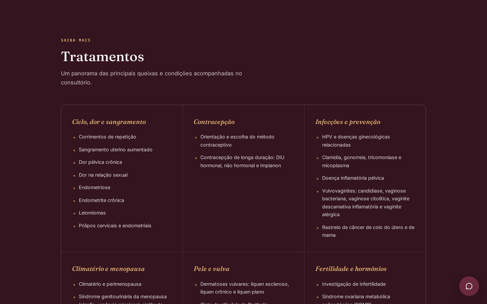
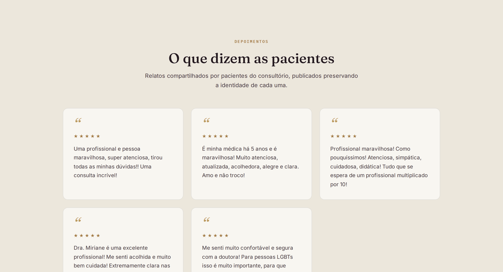

# 🌿 Site — Dra. Miriane Borges Marques

**Landing page médica feita para transformar visitas em consultas agendadas.**

Projeto real, em produção, desenvolvido para a Dra. Miriane Borges Marques, médica ginecologista em São Paulo. Site institucional completo — identidade visual autoral, copy responsável e uma jornada pensada, do primeiro scroll até o "Agendar" no WhatsApp.

🔗 **Site no ar:** [mirianemarques.com](https://mirianemarques.com)


## 💡 Sobre o projeto

Site institucional para consultório médico, criado do zero: identidade visual, copywriting, estrutura de conteúdo e desenvolvimento front-end. O objetivo era direto — apresentar a Dra. Miriane com credibilidade e converter cada visita em uma conversa iniciada no WhatsApp, sem fricção.

Alguns detalhes que fazem diferença:

- **Paleta autoral** (vinho, dourado e sálvia) fugindo do azul-clínico batido
- **Tipografia editorial** — serifada nos destaques, sóbria no corpo — para transmitir autoridade sem soar corporativo ou frio
- **Copy revisado** à luz da Resolução CFM nº 2.336/2023 sobre publicidade médica: depoimentos sóbrios, sem promessa de resultado
- **Conformidade com a LGPD**: política de privacidade dedicada + banner de consentimento

## ✨ Destaques técnicos

- 📱 **Totalmente responsivo** — mobile, tablet e desktop, ajustado seção por seção
- 💬 **CTA para WhatsApp** em cada ponto de conversão, com mensagem pré-preenchida
- 🗺️ **Mapa interativo** do consultório com Leaflet + OpenStreetMap (sem chave de API, sem custo)
- 🔒 **Banner de privacidade LGPD**, com o consentimento do visitante persistido em `localStorage`
- 🎬 **Animações scroll-reveal** via `IntersectionObserver`, leves e sem dependências externas
- 🖼️ **Zero build step** — HTML/CSS/JS puro, imagens embarcadas em base64, um único arquivo publicável
- 🌐 **Deploy em GitHub Pages** com domínio próprio e HTTPS automático

## 📸 Mais telas

<table>
<tr>
<td width="50%"><br/><sub align="center">Tratamentos</sub></td>
<td width="50%"><br/><sub>Depoimentos</sub></td>
</tr>
</table>


## 🛠️ Tecnologias

- HTML5 semântico
- CSS3 — custom properties (design tokens), Grid, Flexbox, `prefers-reduced-motion`
- JavaScript puro (sem frameworks)
- [Leaflet.js](https://leafletjs.com/) + OpenStreetMap
- Google Fonts — Fraunces, Inter, IBM Plex Mono
- GitHub Pages + domínio customizado

## 📁 Estrutura

```
site-miriane/
├── index.html                     # site completo (single file)
├── politica-de-privacidade.html   # política de privacidade LGPD
├── CNAME                          # domínio customizado (GitHub Pages)
└── .github/screenshots/           # imagens usadas neste README
```

## 🚀 Rodando localmente

Sem build, sem dependências — é só abrir:

```bash
git clone https://github.com/renatoesteves/site-miriane.git
cd site-miriane
open index.html          # ou: python3 -m http.server, depois localhost:8000
```

## 👋 Sobre o desenvolvedor

Se você chegou até aqui, talvez esteja pensando em ter um site assim para o seu negócio. Eu crio sites rápidos, responsivos e pensados para conversão — do zero ao ar.

- 🐙 GitHub: [@renatoesteves](https://github.com/renatoesteves)
- 📧 Contato: `seu-email@exemplo.com`
- 💼 LinkedIn / portfólio: `adicione aqui o link`

---

<p align="center"><sub>Feito com atenção aos detalhes, para uma médica que também presta atenção aos detalhes.</sub></p>
